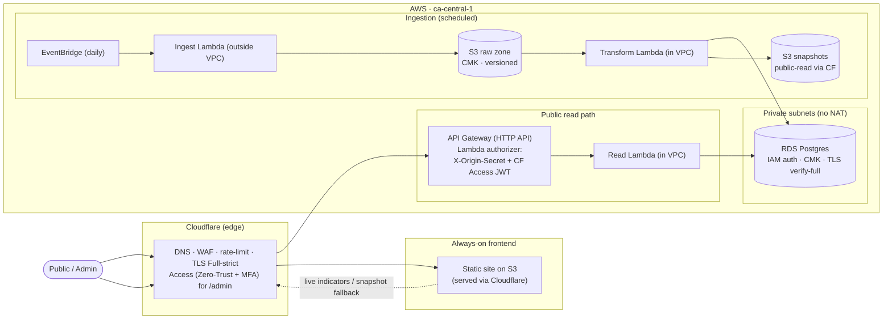

# LoonVault

**A bank-grade secure data platform — a portfolio project for a cloud-security specialist role in financial services.**

A public API serving Bank of Canada cost-of-living indicators, built and secured the way a Canadian
financial institution would: defense-in-depth, mapped to the **OSFI B-13** Technology & Cyber Risk
framework (with **OSFI E-23**, **GC Cloud Guardrails**, and **CIS** as secondary lenses), a working
**STRIDE threat model**, and **live attack-and-defense demonstrations**.

> **The data is payload, not the point.** Bank of Canada indicators exist to justify real
> infrastructure worth securing. All engineering effort goes toward the **security** story.

---

## Architecture



**Two-part shape:**
- **Ephemeral backend** — `terraform apply` before a demo, `terraform destroy` after (keeps cost `< $10/mo`).
- **Always-on frontend** — a static site on S3 behind Cloudflare; survives backend teardown and falls
  back to public S3 snapshots when the API is down.

Everything is in **`ca-central-1`**, provisioned with **Terraform** (AWS *and* Cloudflare).

---

## Security highlights

Each control maps to a threat in the model and an OSFI B-13 principle, so the attack demos double as evidence.

- **Identity** — tiered access: rate-limited public reads; admin plane behind **Cloudflare Access
  (Zero-Trust + MFA)** with the **CF Access JWT validated at the origin**. Least-privilege IAM role per
  Lambda (exact actions, no wildcards).
- **Secrets / DB auth** — **RDS IAM authentication** ([ADR-0006](docs/adr/0006-rds-iam-authentication.md)):
  app DB users have *no stored credential*; tokens are signed locally (SigV4, 15-min TTL).
- **Network** — private subnets for RDS + in-VPC Lambdas; **security-group-to-security-group ingress only
  (no CIDR)**; gateway VPC endpoints (no NAT); VPC Flow Logs.
- **Data** — encryption at rest (CMK on S3 raw zone, RDS, Secrets Manager); **TLS 1.2 at every hop**;
  S3 Block Public Access on private buckets.
- **Org guardrail** — a **region-lock SCP** ([ADR-0009](docs/adr/0009-region-lock-scp-at-workloads-ou.md))
  attached at a Workloads OU pins all workloads to `ca-central-1`.
- **Audit** — a **persistent, organization-wide CloudTrail** (multi-region, log-file validation,
  KMS-encrypted, delivered to a locked-down bucket member accounts can't tamper with or read).
- **Supply chain / CI** — credential-free CI (all applies are terminal-only via short-lived IAM Identity
  Center sessions); SHA-pinned Actions; hash-pinned Lambda deps; gitleaks/betterleaks/TruffleHog, Checkov,
  Semgrep, tflint, Dependabot.

### Policy-as-code & compliance-as-code (the crown jewel)

A pre-deploy **OPA / conftest policy gate** evaluates every Terraform change against the *plan JSON*
before it can deploy — catching open SSH, public S3, non-SG-to-SG database ingress, and out-of-region
resources. See [`policies/`](policies/).

- Each rule is annotated with the **OSFI B-13 principle + GC Cloud Guardrail** it enforces, and the
  coverage matrix is **generated from that metadata** ([`policies/COMPLIANCE.md`](policies/COMPLIANCE.md))
  — compliance evidence that can't drift from the rules.
- The gate runs in **CI** (unit tests), as a **pre-push hook**, and on **`just loonvault-apply`**; every
  real-plan run leaves a per-run audit artifact.
- **Demonstrated:** [`docs/demo/policy-gate/`](docs/demo/policy-gate/) captures the gate **blocking** a
  change that opens SSH to the world and creates a public bucket (attack/defense scenario #4).

Layered model: **SCP** (org guardrail) → **OPA-on-plan** (pre-deploy) → **Prowler** (post-deploy).

---

## Compliance & threat model

- **STRIDE threat model:** [`docs/threat-model.md`](docs/threat-model.md)
- **OSFI B-13 / E-23 & GC Cloud Guardrails mapping:** in [`plan.md`](plan.md)
- **Architecture decisions:** [`docs/adr/`](docs/adr/) (single-CMK, RDS IAM auth, ephemeral/always-on
  split, region-lock SCP, OPA-on-plan, …)
- **Domain glossary:** [`CONTEXT.md`](CONTEXT.md) (Series · Pressure Metric · Indicator · Observation)

---

## Repository layout

```
infra/
  bootstrap/   Terraform remote state (encrypted S3 + DynamoDB lock)
  org/         AWS Organizations: region-lock SCP at a Workloads OU
  loonvault/   ephemeral backend: VPC, RDS, Lambdas, API GW, detection
  frontend/    always-on: public snapshots bucket (survives backend destroy)
lambdas/       ingest · transform · read · authorizer (+ RDS CA layer)
policies/      OPA/conftest policy-as-code + generated compliance matrix
docs/          threat-model · runbook · ADRs · agent skill config · demo evidence
scripts/       verify-docs · org CloudTrail bootstrap · policy gate + report
.github/       per-component CI workflows (terraform, sast, secrets, lint, …)
Justfile       task runner — `just loonvault-apply`, `just policy-test`, …
```

## Running it

All credentialed Terraform is **terminal-only** (CI never holds AWS credentials). Common tasks:

```bash
just policy-test        # run the OPA policy unit tests (offline)
just loonvault-plan     # plan + OPA policy gate
just loonvault-apply    # plan → gate → confirm → apply (ephemeral backend)
just loonvault-destroy  # tear the backend down
```

See [`docs/runbook.md`](docs/runbook.md) for the full deploy lifecycle (incl. break-glass + db-init).

---

## Status

Foundation-first; each phase leaves a deployable, secure thing.

- ✅ **Secure foundation** — remote state, region-lock SCP, org-wide CloudTrail, split per-component CI
  with the full scanner suite, OPA-on-plan policy gate + compliance-as-code.
- ✅ **Vertical slice** — one indicator → S3 → RDS → secured public `GET`; validated live end-to-end.
- ✅ **Attack/defense #4 (crown jewel)** — OPA blocks an insecure deploy, with captured evidence.
- 🔜 **In progress** — frontend site, remaining detection rules + Prowler, the remaining attack/defense
  demonstrations.

> Backend endpoints (`api-loonvault.cloudsecuritypractice.com`) are **on-demand** — stood up for demos
> and torn down after. The frontend is the always-on entry point.
